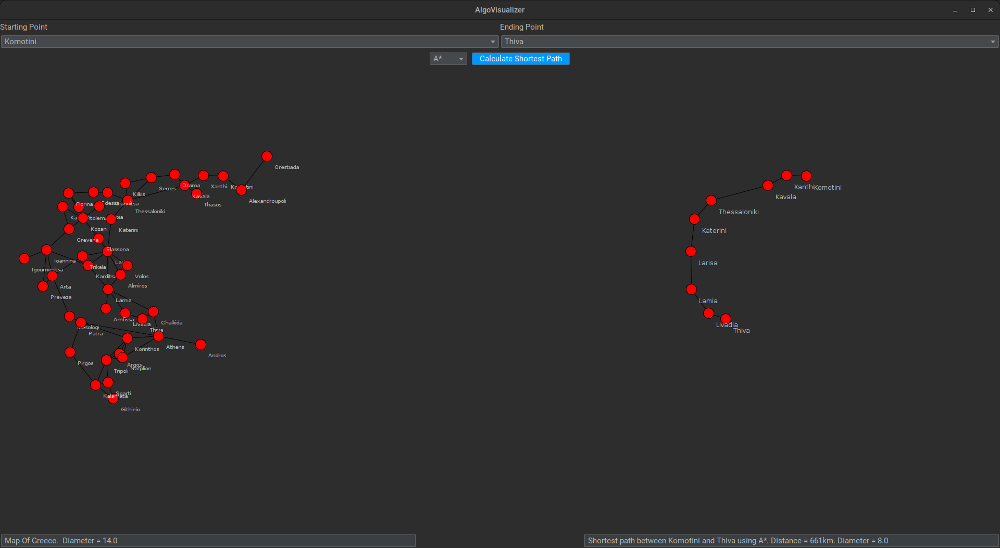

# AlgoVisualizer

The **AlgoVisualizer** is a program designed to manage cities and the connections between them using graphs, built using Java. This project allows for the representation of geographic data for cities in Greece, the creation of connections between them, and the storage of these connections within a system.

## Description

The program includes:
- A set of Greek cities and their geographical coordinates.
- Connections between cities to represent road links.
- Logic to visualize these cities and connections on a map or through applications.

## Technologies

- **Java** (JDK 11 or higher)
- **IDE**: IntelliJ IDEA, Eclipse, or any IDE that supports Java

## Prerequisites

Before running the project, ensure that you have the following technologies installed:

- **Java Development Kit (JDK 11 or higher)**: [Download from Oracle](https://www.oracle.com/java/technologies/javase-jdk11-downloads.html)
- **IDE**: Choose an Integrated Development Environment (IDE) that supports Java, such as IntelliJ IDEA or Eclipse.

## Setup Instructions

1. Clone this repository to your local machine:

   ```bash
   git clone https://github.com/rafailsialakis/AlgoVisualizer
   ```
   
2. Run the .jar
   ```bash
   java -jar AlgoVisualizer.jar
   ```
## Demonstration


## Features
- City management
- Connection handling
- Geographic representation
